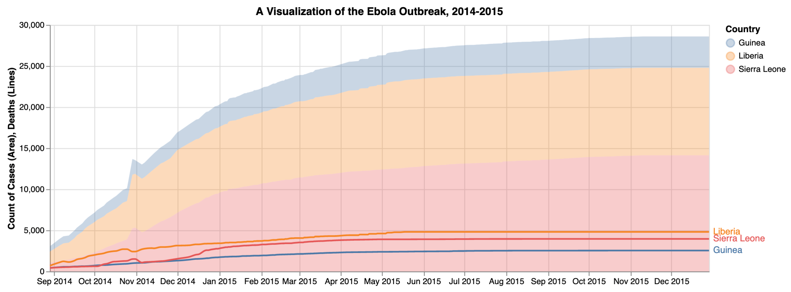
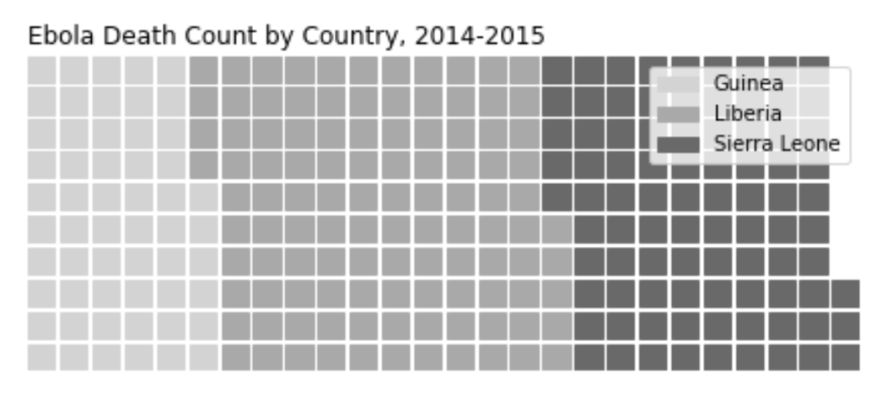

# Exploring Data Visualizations in Python

## Project Purpose
- I want to learn more about data visualization in Python and practice creating different charts in this language. I am not doing this project for a client or a job, but solely so I can improve my data visualization skills in Python.
- I chose this dataset because I read a book about the ebola outbreak when I was highschool and wanted to learn more about it from a data angle. To do this, I will create at least two different charts visualizing the Ebola outbreak of 2014 and 2015. 

## Tools Used
- I chose to use Python for the project because I have less experience with this language. I will use both Altair and Matplotlib to create my charts. The scripts I created for this project can be found here:
 - [data_munging.py](https://github.com/mboyd47/data-visualization-boyd-python/blob/main/scripts/data_munging.py)
 - [visualizations.py](https://github.com/mboyd47/data-visualization-boyd-python/blob/main/scripts/visualizations.py)

## Results
- For the first chart, I used Altair to create two different charts and layer them into one chart to show both case and death counts by country. First, I created an area chart that showed the number of cases per country over time. The second chart I created was a line chart that showed the number of deaths per country over time. I then layered them together into one chart and finished it with a title and axis labels.

- This next chart I created using pywaffle in matplotlib to show the overall number deaths by country. I grouped the deaths dataset by country, then summed up the number of deaths for the three countries. When I created the chart, I divided the sum of deaths by 10,000 in order the reduce the number of pieces in the waffle chart so it would be easier to read. In the final chart, you can see that Liberia had the highest death count overall.

## Conclusion
- Charts such as these that visualize virus outbreaks have numerous possible applications in the world today. Identifying patterns in the virus' transmission and death rates could help doctors and researchers to learn more about the virus and how to slow its spread or possibly cure it. With more data, even more detailed and useful visualizations could be made in the future to eventually help people all over the world.
